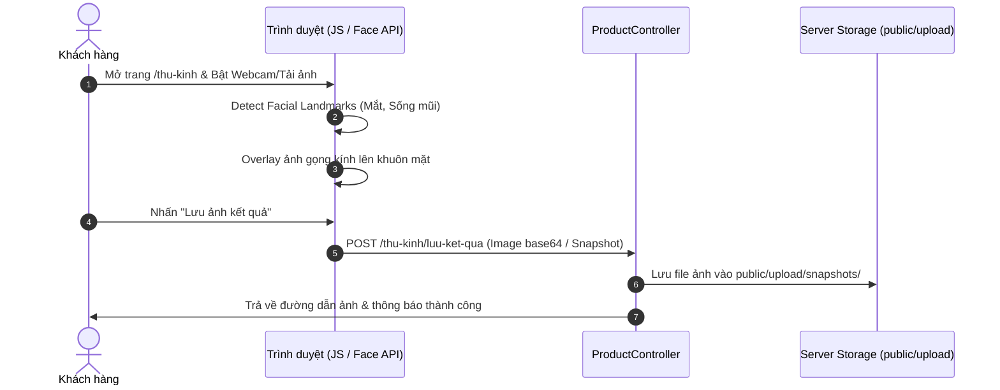
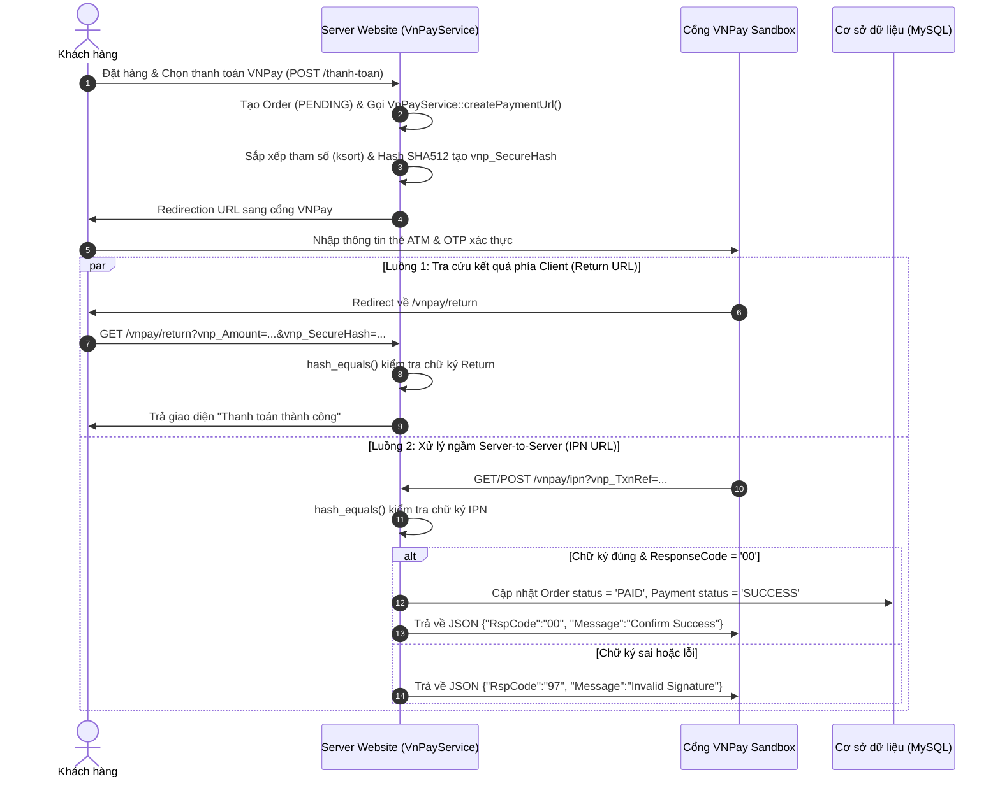
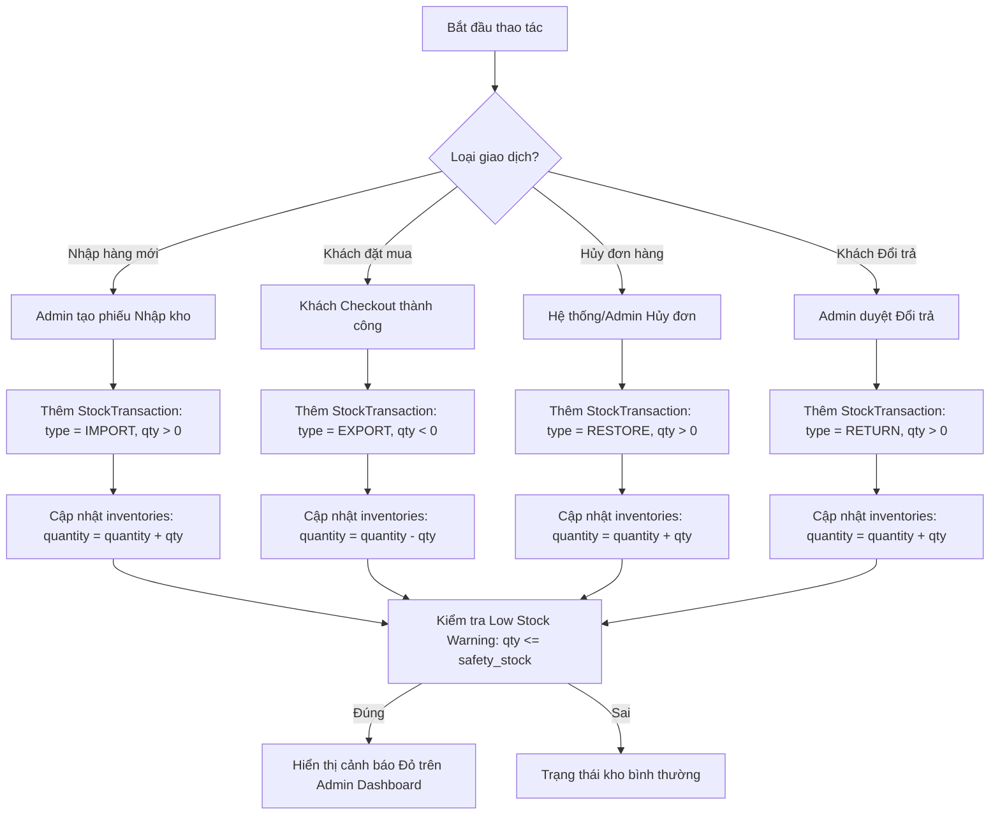
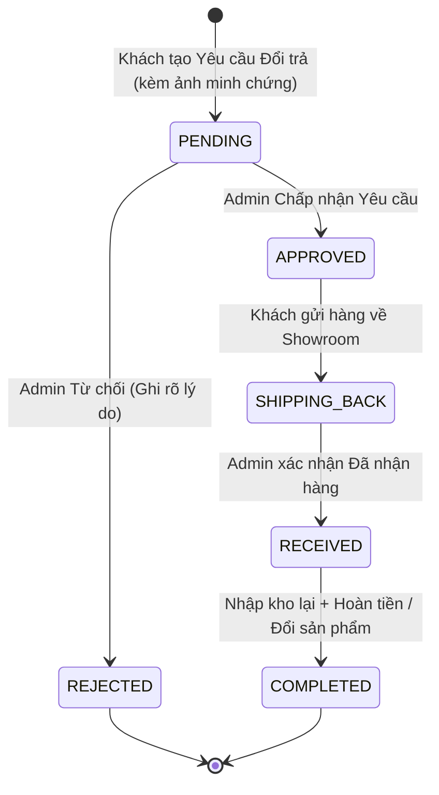

# Sơ Đồ Quy Trình & Luồng Xử Lý Dữ Liệu (Process Flow Diagrams)

Tài liệu này tổng hợp toàn bộ các **Sơ đồ quy trình xử lý (Process Flowcharts & Sequence Diagrams)** của dự án Website Bán Kính Mắt. Bạn có thể sử dụng các sơ đồ Mermaid này để chèn thẳng vào **Slide thuyết trình bảo vệ đồ án** trước hội đồng.

---

## 🔄 1. QUY TRÌNH THỦ KÍNH AI (VIRTUAL TRY-ON PROCESS)

Quy trình nhận diện khuôn mặt và lồng ghép gọng kính 2D/3D trực tiếp trên trình duyệt.

### ✨ Giải thích quy trình với Hội đồng:
1. **Bước 1:** Trình duyệt gọi Camera qua WebRTC API hoặc nhận file ảnh từ client.
2. **Bước 2:** Thư viện JS quét 68 điểm mốc khuôn mặt (Facial Landmarks) để xác định tâm 2 mắt và sống mũi.
3. **Bước 3:** Tự động tính toán góc nghiêng và kích thước để đặt file PNG gọng kính trùng khớp vào khuôn mặt.
4. **Bước 4:** Khi khách nhấn lưu, hệ thống chụp lại canvas, gửi AJAX lên `ProductController@storeTryOnSnapshot` để lưu lại vết thử kính.

---

## 💳 2. QUY TRÌNH THANH TOÁN VNPAY & XÁC THỰC CHỮ KÝ SHA512

Quy trình thanh toán an toàn 3 bên: Khách hàng ↔ Server Website ↔ Cổng thanh toán VNPay.

### ✨ Giải thích quy trình với Hội đồng:
1. **Tạo chữ ký:** Server gọi `VnPayService` để tạo ra chuỗi hash `vnp_SecureHash` bằng thuật toán **HMAC-SHA512** bảo mật cao.
2. **Đảm bảo tính toàn vẹn:** Khách hàng không thể tự sửa số tiền trên URL vì VNPay sẽ tính lại Hash với `Secret Key` và chặn ngay nếu không khớp.
3. **Cập nhật IPN:** Sử dụng cơ chế IPN (Instant Payment Notification) đảm bảo dù khách có tắt trình duyệt giữa chừng thì Server VNPay vẫn chủ động báo cho Server website để chốt đơn thành công.

---

## 📦 3. QUY TRÌNH QUẢN LÝ TỒN KHO & BIẾN ĐỘNG KHO (STOCK TRANSACTION)

Quy trình kiểm soát tồn kho chặt chẽ qua bảng lịch sử `stock_transactions`.

### ✨ Giải thích quy trình với Hội đồng:
- Hệ thống không chỉ lưu số tồn kho hiện tại mà còn lưu **lịch sử mọi biến động** (`StockTransaction`).
- Mọi hành động Xuất, Nhập, Hủy đơn hay Đổi trả đều được ghi vết minh bạch để đối soát kế toán cuối tháng.

---

## 🔄 4. QUY TRÌNH XỬ LÝ ĐỔI TRẢ HÀNG (RETURN REQUEST PROCESS)

Quy trình quản lý yêu cầu hoàn tiền / đổi sản phẩm từ khách hàng.

### ✨ Giải thích quy trình với Hội đồng:
- Khách hàng tạo yêu cầu trực tiếp trên website kèm lý do và ảnh chụp sản phẩm bị lỗi.
- Admin kiểm duyệt trên trang Quản trị -> Duyệt -> Khách gửi hàng -> Xác nhận -> Tự động nhập kho lại kính và hoàn tất quy trình.
