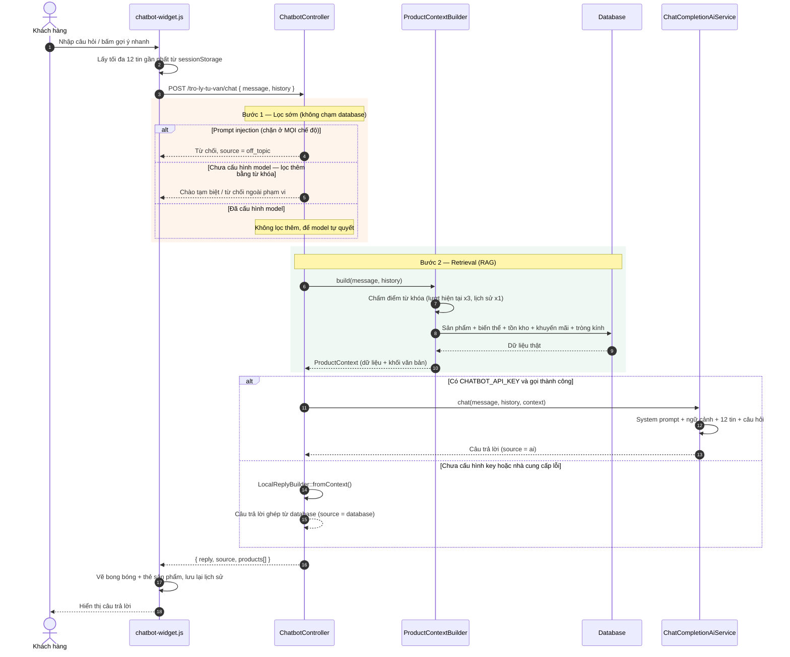

# Module Chatbot AI — Trợ lý tư vấn

Module này thêm một trợ lý tư vấn nổi ở mọi trang phía khách. Điểm khác biệt so với chatbot kịch bản thông thường: mọi con số về giá, màu, size, tồn kho và mã giảm giá đều được **truy xuất từ database ngay trước khi hỏi model** (kiến trúc RAG — Retrieval Augmented Generation), nên chatbot không có cơ hội bịa số liệu.

## 1. Các file trong module

| Lớp | File | Vai trò |
| --- | --- | --- |
| Cấu hình | `config/chatbot.php` | Key, endpoint, model, nhiệt độ, các trần ngữ cảnh |
| Lọc sớm | `app/Services/Chatbot/MessageClassifier.php` | Nhận diện câu chào kết, câu ngoài phạm vi, prompt injection; chuẩn hóa & tách từ tiếng Việt |
| Từ vựng | `app/Services/Chatbot/CatalogVocabulary.php` | Tên thương hiệu/danh mục/dáng gọng/chất liệu/màu lấy thẳng từ database (cache 30 phút) |
| Retrieval | `app/Services/Chatbot/ProductContextBuilder.php` | Chấm điểm từ khóa, truy vấn sản phẩm/tồn kho/khuyến mãi/tròng kính, dựng khối ngữ cảnh |
| DTO | `app/Services/Chatbot/ProductContext.php` | Kết quả truy xuất: dữ liệu có cấu trúc + bản văn bản cho prompt |
| DTO | `app/Services/Chatbot/AiReply.php` | Tách câu trả lời của model thành phần chữ cho khách và danh sách mã sản phẩm để dựng thẻ |
| Đơn hàng | `app/Services/Chatbot/CustomerOrderContext.php` | Đơn của chính khách đang đăng nhập, lọc cứng theo `user_id` của phiên |
| Generation | `app/Services/Chatbot/ChatCompletionAiService.php` | Gọi API chuẩn OpenAI Chat Completions |
| Dự phòng | `app/Services/Chatbot/LocalReplyBuilder.php` | Ghép câu trả lời thẳng từ database khi không có AI |
| Controller | `app/Http/Controllers/ChatbotController.php` | Điều phối 4 bước, trả JSON |
| Giao diện | `resources/views/partials/chatbot-widget.blade.php`, `public/js/chatbot-widget.js`, `public/css/views/chatbot.css` | Widget nổi, lịch sử hội thoại, thẻ sản phẩm |
| Test | `tests/Feature/ChatbotTest.php` | 18 test phủ cả hai chế độ và các ràng buộc bảo mật đơn hàng |

Route: `POST /tro-ly-tu-van/chat` (tên `chatbot.chat`), throttle `chatbot` = 15 request/phút cho mỗi user hoặc IP.

Sửa thêm ở `bootstrap/app.php`: `shouldRenderJsonWhen` vốn chỉ mở cho `api/*`, nay mở thêm cho `chatbot.*`. Endpoint này nằm trong nhóm web (cần session + CSRF) nhưng được gọi bằng `fetch`; không mở ngoại lệ thì lỗi validate hoặc lỗi 429 trả về **302**, `fetch` đi theo redirect, nhận HTML rồi vỡ ở `response.json()`.

## 2. Luồng xử lý một lượt nhắn



## 3. Vì sao chia làm 4 bước

**Bước 1 — Lọc sớm.** Đây là chỗ dễ thiết kế sai nhất của cả module, nên nói rõ: **lớp từ khóa gần như chỉ chạy khi CHƯA cấu hình model.**

| | Có model | Không có model |
| --- | --- | --- |
| Chặn prompt injection | ✅ | ✅ |
| Lọc câu chào kết bằng từ khóa | ❌ nhường model | ✅ |
| Lọc câu ngoài phạm vi bằng từ khóa | ❌ nhường model | ✅ |
| Viết câu trả lời | model | `LocalReplyBuilder` |

Lý do: model đọc được câu chữ, danh sách từ khóa thì không. Chặn trước bằng từ khóa khi đã có model chỉ tạo ra từ chối oan — câu "cái đó bao nhiêu tiền?" không chứa chữ nào thuộc ngành kính nhưng rõ ràng là câu hỏi hợp lệ. Nói gọn: siết tay ở tầng này đúng bằng việc trả tiền cho một model rồi không cho nó làm việc. Thực tế đo được: hỏi "useState trong react là gì" khi có model thì model tự từ chối và mời quay lại chủ đề kính, `source = ai`.

**Ngoại lệ duy nhất là prompt injection**, luôn chạy ở mọi chế độ: giao việc phòng thủ prompt injection cho chính model đang bị tấn công thì không còn là phòng thủ. Nó chặn cả khi tin nhắn có kèm từ khóa ngành kính, vì thêm chữ "kính" vào câu là cách né bộ lọc dễ nhất.

Ở chế độ **không có model**, luật bị đảo lại: tin nhắn không mang bất kỳ tín hiệu ngành kính nào thì coi như ngoài phạm vi. Blocklist viết tay không bao giờ đủ — trước khi có luật đảo này, "useState trong react là gì" không trúng từ cấm nào nên lọt xuống nhánh gợi ý và bot đáp lại bằng 4 mẫu Ray-Ban. "Tín hiệu ngành kính" gồm cả danh sách từ khóa tĩnh **và** từ vựng lấy thẳng từ dữ liệu (`CatalogVocabulary`: tên thương hiệu, danh mục, dáng gọng, chất liệu, màu). Nhờ phần dữ liệu này, admin thêm thương hiệu mới thì chatbot nhận ra ngay chứ không phải sửa code.

Mọi so khớp đều theo **ranh giới từ** chứ không phải substring. Đây không phải chi tiết làm cho đẹp: allow-list có những từ rất ngắn như `gia`, `mau`, `cod`. Nếu so bằng `str_contains` thì "giải bài tập" chứa `gia` nên được coi là câu hỏi về kính, còn "code" chứa `cod` nên được coi là câu hỏi về thanh toán COD — cả hai bộ lọc hỏng theo cách rất khó nhìn ra khi đọc log.

**Bước 2 — Retrieval.** Model ngôn ngữ không biết gì về kho hàng của shop. Hỏi thẳng "gọng titan giá bao nhiêu" thì nó bịa ra một con số nghe rất hợp lý và khách sẽ tin.

Trọng số từ khóa: lượt hiện tại x3, tối đa 6 tin gần nhất **của khách** x1. Chênh lệch này là thứ xử lý được câu hỏi nối tiếp — khách hỏi "gọng Titan có mẫu nào" rồi hỏi tiếp "còn màu gì?"; câu sau gần như không có từ khóa sản phẩm, nhưng `titan` trong lịch sử vẫn đủ điểm để kéo đúng nhóm cũ lên đầu. Chỉ lấy từ khóa từ **lời khách**: câu trả lời của bot luôn chứa tên hàng loạt sản phẩm đã liệt kê, đưa vào thì lượt nào cũng khớp nhóm cũ và chatbot không đổi chủ đề được nữa.

Hai chi tiết về hiệu năng, cả hai đều là lỗi thật nếu bỏ qua:

- Lọc thô bằng `LIKE` ở SQL trước rồi mới chấm điểm trong PHP. Không có bước này thì mỗi tin nhắn phải nạp toàn bộ bảng `products` kèm variants lên bộ nhớ chỉ để chọn 8 dòng.
- Tồn kho của tất cả biến thể lấy trong **một** truy vấn gộp. Gọi `InventoryService::sellableQuantityFor()` cho từng biến thể thì đúng logic nhưng thành N+1: 8 sản phẩm × 6 biến thể = 48 truy vấn cho mỗi tin nhắn. Điều kiện lọc kho ở đây phải khớp đúng với service đó (kho `ACTIVE`, không phải kho lỗi `QUARANTINE`).

**Bước 3 — Generation.** `ChatCompletionAiService` cố tình không biết gì về database: nó nhận sẵn khối ngữ cảnh, ghép system prompt + lịch sử + câu hỏi rồi gửi đi. Nhờ vậy đổi nhà cung cấp AI (OpenAI, Groq, OpenRouter, server tự host) chỉ là đổi `CHATBOT_BASE_URL` trong `.env`.

`temperature = 0.35`: bài toán ở đây là đọc đúng giá và tồn kho trong ngữ cảnh, không phải sáng tác.

**Bước 4 — Dự phòng.** Chạy trong hai tình huống thật: chưa cấu hình key (máy dev, môi trường demo, lúc hết hạn mức) và nhà cung cấp lỗi/timeout. Câu trả lời ghép thẳng từ dữ liệu nên kém tự nhiên hơn, bù lại không bao giờ sai số liệu. Thà khô mà đúng còn hơn để khách nhìn thấy "Xin lỗi, hệ thống đang bận".

## 3b. Ba quy tắc nghiệp vụ được mã hóa trong bot

**Tròng kính: báo giá được, nhưng KHÔNG bán online.** Câu trả lời phải có đủ hai nửa. Bỏ nửa giá thì khách hỏi giá mà không nhận được giá. Bỏ nửa "không bán online" thì khách tưởng đặt tròng trên web được, trong khi tròng phải cắt theo độ cận/loạn/viễn của từng người nên bắt buộc đo mắt trực tiếp — hứa giao tròng qua đơn online là hứa thay cửa hàng. Nhánh này báo giá tráng phủ đúng theo `lens_options`, nói rõ đó là giá tham khảo (giá cuối còn tuỳ độ), rồi hướng khách đặt lịch đo mắt hoặc ghé cửa hàng.

Gọng kính và kính mát thì ngược lại — bán online bình thường, COD hoặc VNPay, miễn phí vận chuyển.

Lưu ý khi thêm từ khóa cho nhánh này: **không** dùng từ trần `trong`. Trong tiếng Việt đó là giới từ ("trong kho", "trong tuần") và sẽ nuốt nhầm hàng loạt câu hỏi khác — phải dùng cụm như `trong kinh`, `trong can`, `cat trong`.

**Hỏi khuyến mãi thì trả lời khuyến mãi.** Có nhánh riêng liệt kê mã giảm giá; nếu để rơi xuống nhánh gợi ý sản phẩm thì câu trả lời mở đầu bằng 4 mẫu gọng rồi mới nhắc mã ở dòng áp chót — đúng dữ liệu nhưng lạc câu hỏi.

**"Mã giảm giá" và "sản phẩm đang giảm giá" là hai câu hỏi khác nhau.** Chúng chỉ khác vài chữ nên bản đầu gộp chung: chuỗi `giam gia` kéo cả "sản phẩm nào đang giảm giá" vào nhánh liệt kê mã, khách hỏi mặt hàng lại nhận về mã. `MessageClassifier::asksForPromoCode()` / `asksForDiscountedProducts()` phân biệt theo quy tắc:

| Câu hỏi có | Kết luận |
| --- | --- |
| Từ gọi thẳng tên mã (`ma giam gia`, `voucher`, `coupon`...) | Hỏi **mã** — kể cả khi câu có kèm tên hàng ("có mã giảm cho kính mát không") |
| Từ giảm giá chung chung + từ chỉ hàng hoá (`san pham`, `kinh`, `gong`, `mau`...) | Hỏi **mặt hàng** đang sale |
| Chỉ có từ giảm giá chung chung | Mặc định hỏi **mã** |

Câu hỏi "mặt hàng nào đang sale" **không** tra được bằng từ khóa — chữ "giảm giá" không nằm trong tên hay mô tả sản phẩm nào cả. Vì vậy `ProductContextBuilder` đổi hẳn tiêu chí truy xuất sang lọc `sale_price < base_price`; làm ở tầng retrieval nên **cả hai** đường AI và database đều nhận đúng dữ liệu.

**Thanh gợi ý bấm nhanh biến mất sau tin nhắn đầu tiên.** Nó chỉ có ích lúc khách chưa biết hỏi gì; giữ lại thì bốn nút chiếm chỗ, đẩy hội thoại lên cao và che ô nhập. Trạng thái ẩn bám theo `sessionStorage` nên khách sang trang khác quay lại vẫn không thấy nó hiện lại.

**Phải có nút xoá hội thoại.** Hệ quả trực tiếp của việc lưu vào `sessionStorage` để sống sót qua các lần chuyển trang: không có đường xoá thì khách bị kẹt với đoạn chat cũ đến hết phiên, kể cả khi đã đổi hẳn sang nhu cầu khác. Nút xoá đặt ở header, dọn cả DOM lẫn `sessionStorage` rồi cho thanh gợi ý hiện lại (đoạn chat trống thì gợi ý lại có ích).

**Chữ và thẻ không được nói cùng một thứ.** Ban đầu model liệt kê đầy đủ tên + giá + link từng mẫu trong phần chữ, rồi bên dưới thẻ sản phẩm hiện lại y hệt — cùng một thông tin đọc hai lần, mà bản chữ thì không có ảnh.

Cách xử lý: model được yêu cầu **chỉ viết 1-2 câu dẫn** (vì sao mấy mẫu đó hợp với khách) và kết thúc bằng một dòng đánh dấu `[[SP: mã1, mã2, mã3]]`. `AiReply::parse()` tách dòng đó ra, cắt khỏi text trước khi trả về cho khách, và dùng danh sách mã để dựng thẻ. Mã vẫn phải đối chiếu ngược lại ngữ cảnh vừa truy xuất — model có thể gõ nhầm hoặc bịa mã, mà thẻ thì dẫn thẳng tới trang sản phẩm nên không được phép sai.

Cách này thay cho cách cũ là dò tên sản phẩm trong câu trả lời — vốn sập ngay khi model thôi liệt kê tên. Giờ model nói thẳng nó đang giới thiệu mẫu nào, và lượt nào không giới thiệu sản phẩm (hỏi chính sách, tròng kính, mã giảm giá) thì nó không khai mã nào nên không có thẻ, mà không cần viết luật riêng cho từng trường hợp.

Ở chế độ không có model, câu trả lời do `LocalReplyBuilder` ghép nên phải hỏi lại chính nó qua `isProductQuestion()`.

Thẻ có **ảnh, tên, giá** và bấm được — ảnh lấy qua accessor `Product::image_url` (tự lo mọi kiểu đường dẫn trong dữ liệu và trả ảnh no-image khi trống, nên thẻ không bao giờ vỡ layout), dùng `object-fit: contain` chứ không `cover` vì gọng kính chụp nền trắng mà cắt cạnh là mất càng kính.

Câu gợi ý bấm nhanh trong widget phải hỏi thứ cửa hàng **thật sự** có. Bản đầu để "tròng chống ánh sáng xanh" trong khi `lens_options` không có loại đó — gợi ý sẵn mà bấm vào lại nhận "mình chưa có thông tin" là ấn tượng đầu tiên tệ nhất.

## 3c. Bẫy schema: `lens_sizes.size_label`

Cột `size_label` **có** trong migration nhưng **không có** trong database thật đang chạy (bản import từ file `.sql`). Nêu tên nó trong danh sách cột của eager load làm cả truy vấn chết với `Unknown column` → endpoint trả 500. `ImportGlassesSku` cũng đang phải kiểm tra `hasColumn()` vì lý do y hệt.

Test chạy trên SQLite dựng từ migration nên **không** bắt được lớp lỗi này — chỉ chạy thật trên MySQL mới lộ. Khi eager load có chỉ định cột, hãy đối chiếu với schema thật, không chỉ với migration.

## 3d. Hỏi về đơn hàng của chính mình

Khách đã đăng nhập hỏi "đơn của tôi tới đâu rồi" thì `CustomerOrderContext` nạp 5 đơn gần nhất của họ vào ngữ cảnh. Hai ràng buộc dưới đây là ràng buộc **bảo mật**, không phải lựa chọn thiết kế:

**1. Lọc theo `user_id` của phiên đăng nhập, không bao giờ theo mã đơn khách gõ.** Tra theo mã đơn nghĩa là bất kỳ ai đăng nhập cũng đọc được đơn của người khác chỉ bằng cách đoán mã — đúng lỗi IDOR kinh điển. Khách có gõ "đơn ORD123 sao rồi" thì mã đó cũng chỉ dùng để lọc *trong* danh sách đơn của chính họ. `user_id` lấy từ `$request->user()`, tuyệt đối không nhận qua payload.

**2. Chỉ đưa vào ngữ cảnh trường thật sự cần: mã đơn, trạng thái, tiền, ngày, tên sản phẩm.** Không đưa số điện thoại và địa chỉ giao hàng. Khối này được gửi sang nhà cung cấp AI bên ngoài, nên mỗi trường thừa là một trường dữ liệu cá nhân rời khỏi hệ thống mà chẳng giúp trả lời tốt hơn.

Ba test khoá chặt các ràng buộc này: đơn của người khác không bao giờ vào prompt, khách vãng lai không có dữ liệu đơn nào, và số điện thoại/địa chỉ không rò ra ngoài.

Nhãn trạng thái phải phủ hết giá trị **có thật** trong bảng `orders` (`AWAITING_PAYMENT`, `DELAY`, `LOST_IN_TRANSIT`, `UNPAID`...). Thiếu một giá trị là chatbot đọc nguyên mã ENUM cho khách nghe — "đơn của bạn đang AWAITING_PAYMENT".

## 4. Ràng buộc bảo mật

| Rủi ro | Cách chặn |
| --- | --- |
| Spam làm tốn tiền API | Throttle `chatbot` 15 req/phút theo user hoặc IP. Đây là endpoint duy nhất của hệ thống mà bị spam gây tốn **tiền thật** chứ không chỉ tốn CPU |
| Nhồi prompt qua trường `history` | `history` do client gửi lên nên không đáng tin: validate tối đa 12 phần tử, mỗi phần tử ≤ 2000 ký tự, `role` chỉ nhận `user`/`assistant`. `message` ≤ 500 ký tự |
| Prompt injection | Chặn ở `MessageClassifier::isOffTopic()` trước khi chạm tới model |
| XSS qua câu trả lời | Widget luôn gán nội dung bằng `textContent`, URL được tách thành thẻ `<a>` dựng bằng DOM API. Câu trả lời đi qua model mà model lại đọc dữ liệu người dùng nhập, nên coi nó là HTML là mở thẳng đường cho stored XSS |
| Lộ API key | `config/chatbot.php` **không** có giá trị mặc định cho `api_key`; thiếu key thì module tự rơi về chế độ database |

## 5. Cấu hình

```env
CHATBOT_API_KEY=            # bỏ trống -> trả lời từ database
CHATBOT_BASE_URL=https://api.openai.com/v1
CHATBOT_MODEL=gpt-4o-mini
CHATBOT_SHOP_NAME="Atelier Optique"
```

Các khóa tùy chọn: `CHATBOT_TEMPERATURE`, `CHATBOT_MAX_TOKENS`, `CHATBOT_TIMEOUT`.

### Chạy trên một máy mới (đọc kỹ, có bẫy)

Clone code về là chatbot chạy được ngay, **nhưng ở chế độ database** — trả lời bằng dữ liệu thật, không có AI. Muốn có AI phải làm đủ hai việc, và cả hai đều nằm NGOÀI repo:

**1. Điền `CHATBOT_API_KEY` vào `.env`.** File `.env` bị gitignore (đúng như vậy — key mà lọt vào git là mất key), nên nó không đi theo code. Chép từ `.env.example` rồi điền key của mình.

**2. Máy phải có CA bundle cho HTTPS.** Đây là cái bẫy: PHP trên Windows/WAMP mặc định **không** có `curl.cainfo`, nên mọi request ra nhà cung cấp AI đều chết với `cURL error 60: SSL certificate problem`. Module bắt lỗi này và im lặng rơi về chế độ database, nên nhìn bên ngoài giống hệt "chưa cấu hình key" — rất dễ mất thời gian đi tìm nhầm chỗ. Server Linux thường có sẵn CA bundle nên không dính.

Cách sửa trên Windows: trỏ `curl.cainfo` và `openssl.cafile` trong `php.ini` tới một file `cacert.pem`, rồi khởi động lại server.

**Cách kiểm tra đang chạy ở chế độ nào:** mỗi phản hồi của endpoint chat có trường `source`. `ai` là đang dùng model; `database` là đang chạy dự phòng. Nếu thấy `database` mà đã điền key, mở `storage/logs/laravel.log` tìm dòng `Chatbot: không gọi được nhà cung cấp AI` — nguyên nhân thật nằm ở đó.

## 6. Kiểm thử

`tests/Feature/ChatbotTest.php` gọi `Http::preventStrayRequests()` ở `setUp()`: nếu một nhánh nào đó lỡ gọi thật ra nhà cung cấp AI, test hỏng ngay chứ không âm thầm tốn tiền và phụ thuộc mạng.

Các trường hợp được phủ: câu chào kết không gọi AI; câu ngoài phạm vi không gọi AI; câu có từ khóa ngành kính **không** bị chặn nhầm; rơi về database khi thiếu key; rơi về database khi nhà cung cấp trả lỗi; câu hỏi tròng kính dẫn về đặt lịch và **không** báo giá; câu hỏi khuyến mãi trả về mã chứ không phải danh sách sản phẩm; câu trả lời AI kèm kiểm tra ngữ cảnh RAG thật sự có mặt trong prompt; `history` quá dài bị từ chối 422.

Chạy:

```bash
php artisan test --filter=ChatbotTest
```
